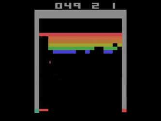

# Assignment 1 - Breakout!

For this first assignment you are going to be building a classic game--breakout!

## Logistics

- You will be working on this first assignment individually on your choice of the Mac, Linux, or Windows Operating Sytstem.
- You will put all of your code and deliverables in the [Game](./Game) directory.

## Assignment Milestones

The assignment has been broken up into 3 milestones for you. You can complete them in any order you like, but the listed order is recommeneded as it follows the course material that will be presented. Stay on track! All portions are due together.

1. [Complete Part 1 first](./part1_README.md)
2. [Complete Part 2 after](./part2_README.md)
3. [Complete Part 3 Last](./part3_README.md)

## Universal Resources

You will be using [SDL2](https://www.libsdl.org/) to build this project. Make sure you can run [SDL2](https://www.libsdl.org/) by following the instructions here: 
(Note you do not need to glad library, unless you are doing additional work with OpenGL 3.3+. The expectation is most folks will use SDL2, though you may contact the instructor if you would like to use OpenGL)

* General SDL2 programming tutorials: 
  * http://lazyfoo.net/tutorials/SDL/
* General SDL2 setup
  * Linux: https://www.youtube.com/embed/xNCFSMkpwWo
  * Windows: https://www.youtube.com/embed/nZbytgAhvoY
  * Mac: https://www.youtube.com/embed/xVl1ysRj_lQ

## Game Requirements (Summary)

## Part 1 - Rubric (40%)

<table>
  <tbody>
    <tr>
      <th>Points</th>
      <th align="center">Description</th>
    </tr>
    <tr>
      <td>10% (Core Requirements)</td>
      <td align="left">Core - Your code <b>must</b> compile using 'python3 build.py' and work on the first try. Pro tip: Try downloading your project to a new directory a clean machine before submitting to see if your game works and could be compiled and run.</td>
    </tr>    
    <tr>
      <td>10% (Core Requirements)</td>
      <td align="left">Core Is their good programming style(classes, OOP), was their only 1 commit right before the deadline? Did everyone make at least one commit in the project. Did you organize your project in the appropriate folders.</td>
    </tr>
    <tr>
      <td>10% (Game Requirements)</td>
      <td align="left">The Game requirements should be met from part 1.</td>
    </tr>
    <tr>
      <td>10% (Polish)</td>
      <td align="left">The game should feel polished. Is it smooth, is the game stylistically coherent(it does not have to be beautiful or complex).</td>
    </tr>
  </tbody>
</table>

**Note: Everyone on your team earns the same grade for all parts of the project.**

### Part 2 - Rubric (40%)

<table>
  <tbody>
    <tr>
      <th>Points</th>
      <th align="center">Description</th>
    </tr>
    <tr>
      <td>10% (Resource Manager)</td>
      <td align="left">There is a resource manager implemented as a singleton class.</td>
    </tr>    
    <tr>
      <td>10% (Frame capping)</td>
      <td align="left">The game is frame capped to 60 FPS</td>
    </tr>
    <tr>
      <td>10% (Level Loading)</td>
      <td align="left">A 'level loading' system is built in (No hard coded variables for loading levels is allowed). There are at least 3 levels in the game, and they are loaded from some script.</td>
    </tr>
    <tr>
      <td>10% (Localization)</td>
      <td align="left">All strings are loaded from a configuration file for the English Language and one other language of your choice.</td>
    </tr>
  </tbody>
</table>

Beyond these requirements, you must also make sure all of the requirements in part 1 are also satisifed. Please make sure your game runs using `python build.py` and continue to test on multiple systems!

### Part 3 - Rubric (20%)

<table>
  <tbody>
    <tr>
      <th>Points</th>
      <th align="center">Description</th>
    </tr>
    <tr>
      <td>5% (Documentation)</td>
      <td align="left">Did you generate something like "http://www.horde3d.org/docs/html/_api.html"?</td>
    </tr>    
    <tr>
      <td>5% (Build)</td>
      <td align="left">Does the build work when I download your repo and run the game?</td>
    </tr>
    <tr>
      <td>5% (Post mortem)</td>
      <td align="left">Did you learn anything and provide a brief and well-thought out reflection of these learnings?</td>
    </tr>
    <tr>
      <td>5% (Website)</td>
      <td align="left">Do you have a webpage that presents your project in a positive way with the above materials.</td>
    </tr>
  </tbody>
</table>
