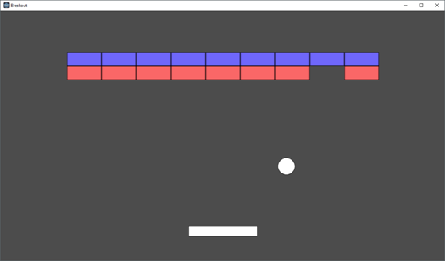

# Breakout - Part 1

Welcome to our first game project! This is the first part in a series of 3 to build a full game! But you are not getting this as just an assignment--we are under contract from a very famous employer! Nolan Busnell(https://en.wikipedia.org/wiki/Nolan_Bushnell) himself has contracted us to build a more powerful version of his 1976 arcade class game! He thinks we could have some success by recreating and distributing the game in Boston, Massachusetts.

Now it is time to get organized and start building the game! **DO NOT disappoint Nolan Bushnell!**

## Step 1 - Play the game!

The first part of this assignment is to play the game here: https://elgoog.im/breakout/ There are many versions of the game, and I encourage you to be creative beyond the requirements of the assignment. The basic premise is a ball, a paddle, and bricks that are destroyed when they are hit. 

The history of the game itself is worth reading as insipiring game and game engine programmers!

* https://en.wikipedia.org/wiki/Breakout_(video_game)
* https://en.wikipedia.org/wiki/Arkanoid

## Step 2 - Getting Setup!

<!-- Make sure you have communicated with and formed your team! (If you are reading this, make sure your teammates have joined your same repository) -->

### Our technology stack

Nolan has commissioned you to use the following technology stack:

* [Modern C++ (11/14/17/20)](https://docs.microsoft.com/en-us/cpp/cpp/welcome-back-to-cpp-modern-cpp?view=vs-2017)
* [SDL2 library](https://www.libsdl.org/download-2.0.php)

Nolan prefers these tools because SDL is an industry standard, cross platform. Using Modern C++ will give us additional control over our performance.

## Game Requirements

The breakout game you are building in part 1 has the following requirements.

1. There is at least one level with blue bricks with 4 rows of 12 bricks.
2. The User interface displays the number of "lives" available (3 to start)
3. The User interface displays the score, correlating to how many bricks have been removed
4. You have a paddle, that is controlled with either:
    - The left and right arrow keys (To move the paddle left and right respectively)
    - <kbd>a</kbd> and <kbd>d</kbd> keys  (To move the paddle left and right respectively)
5. When the ball collides with the paddle, it should change velocity in the opposite direction.
    - (Note, we will build a 'TinyMath.h' library to help handle things like collision, modeling velocity, etc.)
6. A sound clip should play on collision.
7. When the user hits <kbd>q</kbd> the program terminates.
8. When all blocks are removed, the game should pause and display "You win!" (Or some equally enthusiastic message).
9. If all lives are lost, the game should pause and display "You Lose!" (Or some equally sad/school appropriate message).
10. There should be a music track looping in the background.
11. You must use a [python3 build.py](./build.py) script to build your project (i.e. the ones provided from the lab are a good starting point).

Beyond those requirements, you may get as creative as you like.

Tips:
* Think about good object-oriented programming style
  * (Nolan Bushnell changes his mind a lot--because the game industry moves fast! I wonder what will happen in part 2?)
* Special effects and cool features are encouraged!

## More Resources

* [SDL2 Documentation](https://wiki.libsdl.org/APIByCategory)
* Free sound effects
  * https://assetstore.unity.com/packages/audio/sound-fx/free-sound-fx-31837
* Free breakout graphics
  * https://assetstore.unity.com/packages/templates/packs/2d-breakout-example-project-107757
* (Typically any 'royalty' free document is fair game for academic use)
