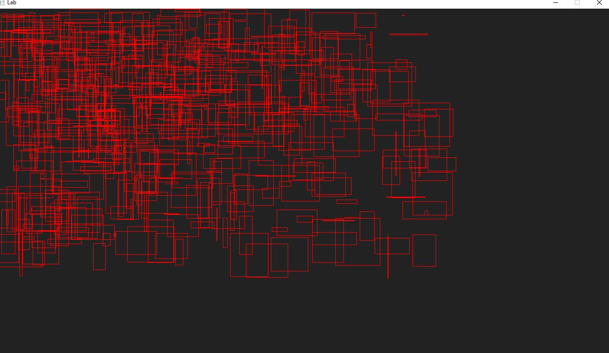

# Lab - Frame Capping

> We are going to get a main loop setup, and take a first peek at SDL.

**Lab materials must be pushed to your repository one week from now before the next class begins**

**Read:** *Labs are designed to be finished in class if you work diligently, but expected to take 1-2 hours outside of class. They are often more 'tutorial' in style, and sometimes the solution may even be provided in pieces for you to type in and experiment. Copying & Pasting is discouraged however--make mistakes, play, and you will further learn the material.*

## Modify this section

- How many hours did it take you to complete this lab?
- Did you collaborate with any other students/TAs/Professors?
- Did you use any external resources? (Cite them below)
  - tbd
  - tbd
- (Optional) What was your favorite part of the lab?
- (Optional) How would you improve the lab?

## Logistics

You will be working on your own laptop today..

## Part 1 - Frame Capping

For this portion of the lab, it will provide a helpful introduction to your breakout projects. I have abstracted some of the SDL initialization components so that our 'main.cpp' is quite small. In fact, you will find a key member function 'loop' that serves as our infinitely running game loop. Take some time to look at this frame work.

### The support code

Provided in the support code is a game loop with a moving object. The object moves at a fixed speed that the developers have thought to originally be good on their system.

There is one problem however. The game was developed on a very specific machine, that had a very specific clock rate. Depending on what hardware you are running on, the object will be moving at different speeds! This is an especially common problem for Desktop and mobile game development (It was less of a problem for old SNES games, where you knew the CPU frequency and that could be relied upon).

* Your goal is to:
  * Output the frames per second (to the console or the screen)
  * Set the frames per second to a fixed rate (60 or 30)
  
Good luck!

### Compiling and running the support code

* Linux, Mac, and Windows (Mysys)
  * Type: `python build.py`
  * Then : `./lab` or `./lab.exe`
  
## Part 2 - SDL Abstraction

*TODO* Question: Is the SDL abstraction in your opinion good? What could be improved? Discuss with your partner and jot a few notes here.

Answer: 

1. *fill this in*
2. *fill this in*

## Helpful Resources

Some additional resources to help you through this lab assignment

- http://lazyfoo.net/tutorials/SDL/23_advanced_timers/index.php
- http://lazyfoo.net/tutorials/SDL/24_calculating_frame_rate/index.php
- http://lazyfoo.net/tutorials/SDL/25_capping_frame_rate/index.php

## Deliverables

- Complete part 1 by implementing frame capping at 60 FPS
- Complete part 2 by critiquing the SDL abstraction.

You must complete this lab one week from today's class. You will run your lab in front of me at the start of the next lab when class starts and tell me what your group # was for that week.

## Rubric

You (and any partner(s)) will receive the same grade from a scale of 0-2.

- 0 for no work completed by the deadline
- 1 for some work completed, but something is not working properly
- 2 for a completed lab (with possible 'going further' options completed)

## Going Further

What is that, you finished Early? Did you enjoy this lab? Here are some (optional) ways to further this assignment.

- Check out some more SDL tutorials

## Found a bug?

If you found a mistake (big or small, including spelling mistakes) in this lab, kindly send me an e-mail. It is not seen as nitpicky, but appreciated! (Or rather, future generations of students will appreciate it!)

- Fun fact: The famous computer scientist Donald Knuth would pay folks one $2.56 for errors in his published works. [[source](https://en.wikipedia.org/wiki/Knuth_reward_check)]
- Unfortunately, there is no monetary reward in this course :)

