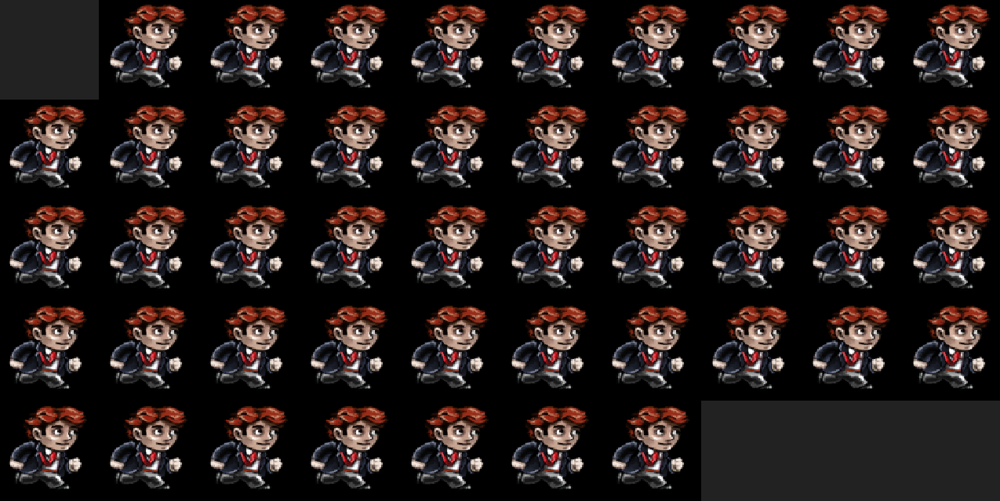

# Lab 3 - Resource Manager



> A resource manager to support sprite animations.

**Lab materials must be pushed to your repository one week from now before the next class begins**

**Read:** *Labs are designed to be finished in class if you work diligently, but expected to take 1-2 hours outside of class. They are often more 'tutorial' in style, and sometimes the solution may even be provided in pieces for you to type in and experiment. Copying & Pasting is discouraged however--make mistakes, play, and you will further learn the material.*

## Modify this section

- How many hours did it take you to complete this lab?
- Did you collaborate with any other students/TAs/Professors?
- Did you use any external resources? (Cite them below)
  - tbd
  - tbd
- (Optional) What was your favorite part of the lab?
- (Optional) How would you improve the lab?

## Logistics

You will be working on your own laptop today modifying files in the [./src](./src) and [./include](./include) directory

## Part 1 - Resource Manager

Your goal for this lab is to implement a resource manager. The resource managers job is to manage all of the assets that you load into your game engine, whether they are sound files, image files, 3D files, or configuration files. For the purpose of this lab, you will only be loading 'image' files.

### Resource Manager Structure

For today's lab, you will implment a [Singleton](https://en.wikipedia.org/wiki/Singleton_pattern) Class for your resource manager. Note that you are provided a Resource Manager in your labs starter code, though you will have to refactor it. An example refactoring to make your ResourceManager a Singleton is shown below, and you may make additional modifications so that it handles the loading of 'image/texture' resources loaded from SDL.

```cpp
// This is an example Resource Manager
// You can use this as a template for implementing your own.

class ResourceManager{
  private:
    ResourceManager();  // Private Singleton
    ResourceManager(ResourceManger const&); // Avoid copy constructor
    void operator=(ResourceManager const&); // Don't allow assignment.
    // ... // perhaps other private members
    
  public:
  
  static ResourceManager &getInstance();
  
  // 'equivalent' to our constructor
  int startUp();
  
  // 'equivalent' to our destructor
  int shutDown();
  
  // ... Perhaps other public functions?
  // *Hint you need at least one other one for the datatype you are supporting*

}:
```

### Additional notes on the support code

Observe in the [SDLGraphicsProgram.cpp](./src/SDLGraphicsProgram.cpp) there is a loop that sets up a number of `CHARACTERS` that will be rendered to the screen. Unfortunately this is not done very efficiently as there is a problem in the current Resource Manager implementation. The main function you need to fix is the 'init' function in your [ResourceManager.cpp](./src/ResourceManager.cpp). Think about how you might refactor your code to load resources using your resource manager. You may make any additional changes to the code. The key is to make sure exactly 1 copy of the image is loaded. Think about what data structures may be useful.

## Part 2 - Resource Manager Design

**Please read and edit** in the [exercise.md](./exercise.md) file your answer.

### Compiling and running the support code

* Linux, Mac, and Windows (Mysys)
  * Type: `python3 build.py`
  * Then : `./lab` (Linux and Mac) or `./lab.exe` (for windows users)
  
## Helpful Resources

Some additional resources to help you through this lab assignment

- Useful C++ Data Structure(s)
  - [std::map series of tutorials](https://thispointer.com/stdmap-tutorial-part-1-usage-detail-with-examples/)
  - [Somewhat trustworthy discussion on map vs unordered map on stack overflow](https://stackoverflow.com/questions/2196995/is-there-any-advantage-of-using-map-over-unordered-map-in-case-of-trivial-keys)
- Resources on Resource Managers
  - [Tutorial 15: ResourceManager, TextureCache!](https://www.youtube.com/watch?v=HBpmfrQINlo)
  - [A Resource Manager for Game Assets](https://www.gamedev.net/articles/programming/general-and-gameplay-programming/a-resource-manager-for-game-assets-r3807/)
  - [Adding a Resource Management Class](http://eangogamedevelopment.blogspot.com/2017/01/part-21-completing-game-menu.html)

## Deliverables

- Part 1 - A singleton class for a resource manager.
  - Note: Your singleton should support the ability to load 'multiple' images, and not just the one provided.
  - Note: Please leave some SDL_Log messages to indicate that the image is only loaded once.
- Part 2 - Answer the questions in part 2.

You must complete this lab one week from today's class.

## Rubric

You (and any partner(s)) will receive the same grade from a scale of 0-2.

- 0 for no work completed by the deadline
- 1 for some work completed, but something is not working properly
- 2 for a completed lab (with possible 'going further' options completed)

## Going Further

What is that, you finished Early? Did you enjoy this lab? Here are some (optional) ways to further this assignment.

- Try using smart pointers. I recommend the shared_ptr. This will make sure your resources are automatically cleaned up when there are no references.
- Animate all of the frames of the character.

## Found a bug?

If you found a mistake (big or small, including spelling mistakes) in this lab, kindly send me an e-mail. It is not seen as nitpicky, but appreciated! (Or rather, future generations of students will appreciate it!)

- Fun fact: The famous computer scientist Donald Knuth would pay folks one $2.56 for errors in his published works. [[source](https://en.wikipedia.org/wiki/Knuth_reward_check)]
- Unfortunately, there is no monetary reward in this course :)
