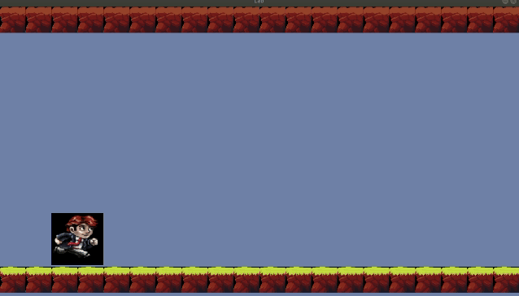
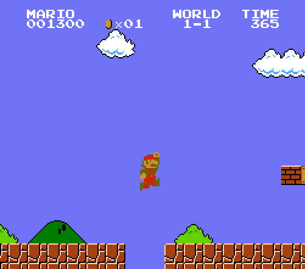

# Lab 5 - Platformer

> "The obvious objective of video games is to entertain people by surprising them with new experiences." - Shigeru Miyamoto

**Lab materials must be pushed to your repository one week from now before the next class begins**

**Read:** *Labs are designed to be finished in class if you work diligently, but expected to take 1-2 hours outside of class. They are often more 'tutorial' in style, and sometimes the solution may even be provided in pieces for you to type in and experiment. Copying & Pasting is discouraged however--make mistakes, play, and you will further learn the material.*

## Modify this section

- How many hours did it take you to complete this lab?
- Did you collaborate with any other students/TAs/Professors?
- Did you use any external resources? (Cite them below)
  - tbd
  - tbd
- (Optional) What was your favorite part of the lab?
- (Optional) How would you improve the lab?

## Logistics

You will be working on your own laptop today.

## Introduction

Many of you may have played or seen the classic game Super Mario Bros (shown on the right). This is a classic game that we categorize in the 'platformer' genre. Platformers are a relatively simple games at their core, but we can add multiple levels of complexity to make them quite complex. This will make platformers a good challenge for us to implement in this course, and we will start by focusing on the tile engine, which is one of the core components of a 2D platformer.

## Part 1 - Game Engines

**Complete**: Check out some of the 'Helpful Resources' articles on building a 2D tile engine.

The tile engine is  the core component of a 2D platformer, so I have provided some resources to help with this lab at the end.

## Part 2 - TileMap.hpp

Provided in this starter code for todays lab is a brief example with a [TileMap.hpp](./include/TileMap.hpp) class implemented. This should provide some ideas on how you might implement a simple tile engine.

Tile maps themselves are useful for drawing graphics onto the screen, but could also be used for other applications like drawing additional layers, collision maps, or pathfinding for AI. For now however, we will focus on the visuals.

### Your Task

Modify the code base such that a tile map is created that is at least 30 x 20 in size. That is, the width is 30 tiles, and the height is 20 tiles. You should also modify any functions such that you generate a tile map with actual tiles in it (i.e. Your entire tile map should not be blank, or otherwise filled with '-1' in each of the tiles. So change some of these values, or modify the 'GenerateSimpleMap' function to automate this process).

## Part 3 - Cameras

After you have completed part 2, you are now likely to have more tiles than can be fit onto the window at any given time. What you will need to do is implement a camera that moves with the arrowkeys so you can see more of your world.

A good resource to learn about camera movement is provided here: https://lazyfoo.net/tutorials/SDL/30_scrolling/index.php

### Your Task

Add a camera such that the <kbd>up</kbd>,<kbd>down</kbd>,<kbd>left</kbd>, and <kbd>right</kbd> arrowkeys move the camera around the world respectively. This will allow you to see the rest of your tilemap.

## Compiling and running the support code

* Linux, Mac, and Windows (Mysys)
  * Type: `python build.py`
  * Then : `./lab` or `./lab.exe` (for windows users)
* You can generate the documentation for the project by running `doxygen doxygen.txt` 

## Helpful Resources

Some additional resources to help you through this lab assignment

- [Introduction to making a tile map engine](https://gamedevelopment.tutsplus.com/tutorials/an-introduction-to-creating-a-tile-map-engine--gamedev-10900)
- [Making a Gameboy game in 2017](https://www.gamasutra.com/blogs/DoctorLudos/20171207/311143/Making_a_Game_Boy_game_in_2017_A_quotSheep_It_Upquot_PostMortem_part_12.php)
  - Some nice ideas on building tools or thinking about the style of the game
- [3D Tile system just for fun](https://www.gamasutra.com/blogs/RyanMiller/20170915/305738/Creating_a_Dynamic_Tile_System.php)
- [Mozilla introduction to TileMaps](https://developer.mozilla.org/en-US/docs/Games/Techniques/Tilemaps)
- [Article on Seamless tiles and other filters/blending techniques](http://devmag.org.za/2009/05/28/getting-more-out-of-seamless-tiles/)

## Deliverables

- You should have increased your tilemap size.
- You should be able to use the arrowkeys to move the camera.

You must complete this lab one week from today's class. You will run your lab in front of me at the start of the next lab when class starts and tell me what your group # was for that week.

## Rubric

You (and any partner(s)) will receive the same grade from a scale of 0-2.

- 0 for no work completed by the deadline
- 1 for some work completed, but something is not working properly
- 2 for a completed lab (with possible 'going further' options completed)

## Going Further

What is that, you finished Early? Did you enjoy this lab? Here are some (optional) ways to further this assignment.

- N/A (Implement features and functionality in your actual project!)

## Found a bug?

If you found a mistake (big or small, including spelling mistakes) in this lab, kindly send me an e-mail. It is not seen as nitpicky, but appreciated! (Or rather, future generations of students will appreciate it!)

- Fun fact: The famous computer scientist Donald Knuth would pay folks one $2.56 for errors in his published works. [[source](https://en.wikipedia.org/wiki/Knuth_reward_check)]
- Unfortunately, there is no monetary reward in this course :)
