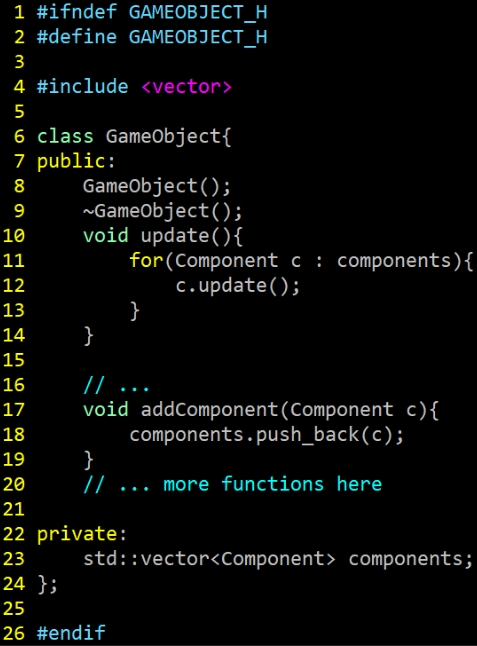
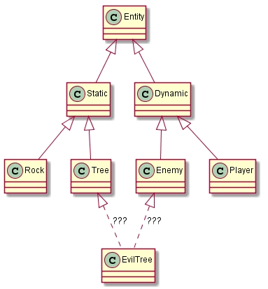
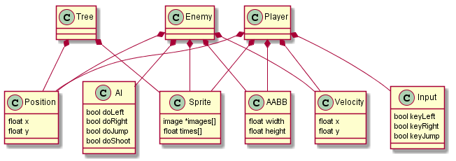

**You may work with your Assignment 2 Teams on this lab**

- [ ] **Check this box (edit this README.md and put an 'x' between the brackets to check the box) if you worked with your A2 teammates on this and we'll take the top score**

# Lab 6 - GameObject and Component

> "Allow a single entity to span multiple domains without coupling the domains to each other." Component Programming Pattern  - Robert Nystrom

**Lab materials must be pushed to your repository one week from now before the next class begins**

**Read:** *Labs are designed to be finished in class if you work diligently, but expected to take 1-2 hours outside of class. They are often more 'tutorial' in style, and sometimes the solution may even be provided in pieces for you to type in and experiment. Copying & Pasting is discouraged however--make mistakes, play, and you will further learn the material.*

## Modify this section

- How many hours did it take you to complete this lab?
  - 5 hrs
- Did you collaborate with any other students/TAs/Professors?
  - No
- Did you use any external resources? (Cite them below)
  - No

## Logistics

You will be working on your own laptop today.

## Introduction

Today we are discussing the [component game programming pattern](https://gameprogrammingpatterns.com/component.html)  to 'decouple' classes and make our games more maintainable (**Please read the chapter** it's very insightful!). 

Typically when we write Object-Oriented Code it can be tempting to create large inheritence structures like what is shown in the figure below. This can quickly become difficult software to maintain and to optimize for performance (Note in the diagram below 'EvilTrees' becomes ambiguous in where it belongs, and if we inherit from two differnt paths, we get the 'deadly diamond inheritance' problem).

>Diagram from: https://www.gamedev.net/tutorials/_/technical/game-programming/understanding-component-entity-systems-r3013/ (The one aspect I do like is the separation of 'static' and 'dynamic' however--that may be useful for optimization purposes of which components change or do not change)

So typically we favor using composition within our game objects, where game objects use a container data structure(e.g. a std::vector<Component>) to hold different components which in effect create a new type of game object based on the combinations of components held and their associated data. Using composition is also much more friendly in regards to *Data-Oriented Design*.

>Diagram from: https://www.gamedev.net/tutorials/_/technical/game-programming/understanding-component-entity-systems-r3013/ (This is a much more 'flat' hierarchy and allows us even more flexibility in how we create our entities. Note: We are likely to have a 'init','update','render' or associated member functions with each component.)

## Part 1 - Investigation

For this first part of today's lab, I want you to take a look at an image of a popular game and try to identify the game objects and what the individual components are within a single or multiple game objects. This will be a useful exercise to start identifying the different components that you may want to abstract for your Game objects. 

**Record** your answers by modifying the [exercise.md](./exercise.md) file.

## Part 2 - GameObject (a.k.a GameEntity or GameActor) 

The GameObject class (sometimes also known as the GameEntity or GameActor class) is one of the most common custom data types for abstracting objects in 2D and 3D games. This class is typically what you will be building your game from, alongside a more general 'component' class.

### Your Task

The **overall goal** is to be able to move the 'main' character left and right with the arrowkeys or 'a' and 'd' keys. 

You are going to do this by creating a 'GameObject' class for the main character, and then add components to that character to achieve the above goal. 

1. **I don't care** how you do this, so long as you have a GameObject class with a list or vector of components that can be added to it to achieve the functionality. 
2. You can modify the code however you like.

Here is my recommendation and what is provided in the starter code:

1. Implement the interface and implementation of a [GameObject.hpp](./include/GameObject.hpp) and [GameObject.cpp](./src/GameObject.cpp) to implement a Game Object.
2. Implement the interface and implementation of a [Component.hpp](./include/Component.hpp) and [Component.cpp](./src/Component.cpp) which will serve as a 'base' class to derive new components.
3. Implement the interface and implementation of [TransformComponent.hpp](./include/TransformComponent.hpp) and [TransformComponent.cpp](./src/TransformComponent.cpp) which is derived from [Component.hpp](./include/Component.hpp).
4. Implement the interface and implementation of [ControllerComponent.hpp](./include/ControllerComponent.hpp) and [ControllerComponent.cpp](./src/ControllerComponent.cpp) which is derived from [Component.hpp](./include/Component.hpp).
5. Refactor 'Sprite' as 'SpriteComponent'  that inherits from 'Component' class.
6. Refactor 'TileMap' as 'TileMapComponent' that inherits from 'Component' class.
7. Within 'Engine' class, store a `std::vector<GameObject> m_gameobjects`. You could then iterates through all `m_gameobjects` within the `Engine::Render` and `Engine::Update` functions.
  - (For now in Engine::Start, you would then create each GameObject for the TileMap and Character)

## Compiling and running the support code

* Linux, Mac, and Windows (Mysys)
  * Type: `python build.py`
  * Then : `./lab` or `./lab.exe` (for windows users)
* You can generate the documentation for the project by running `doxygen doxygen.txt` 

## Helpful Resources

Some additional resources to help you through this lab assignment

- [https://gameprogrammingpatterns.com/component.html](https://gameprogrammingpatterns.com/component.html)
  - Essential Reading -- The component programming pattern 
- [Creating the GameObject Class](https://www.youtube.com/watch?v=jzasDqPmtPI&list=PLhfAbcv9cehhkG7ZQK0nfIGJC_C-wSLrx&index=5) 
  - Looks like a helpful C++/SDL2 tutorial on building Game objects.

## Deliverables

1. Edit your reponse in Part 1 in the [exercise.md](./exercise.md) file.
2. Implement a GameObject, Component, and any associated components such that I can move the character left and right with the arrowkeys or 'a' and 'd' keys.

You must complete this lab one week from today's class by pushing your code to your repo before the next class.

## Rubric

You (and any partner(s)) will receive the same grade from a scale of 0-2.

- 0 for no work completed by the deadline
- 1 for some work completed, but something is not working properly
- 2 for a completed lab (with possible 'going further' options completed)

## Going Further

What is that, you finished Early? Did you enjoy this lab? Here are some (optional) ways to further this assignment.

- N/A (Implement features and functionality in your actual project!)

## Found a bug?

If you found a mistake (big or small, including spelling mistakes) in this lab, kindly send me an e-mail. It is not seen as nitpicky, but appreciated! (Or rather, future generations of students will appreciate it!)

- Fun fact: The famous computer scientist Donald Knuth would pay folks one $2.56 for errors in his published works. [[source](https://en.wikipedia.org/wiki/Knuth_reward_check)]
- Unfortunately, there is no monetary reward in this course :)
